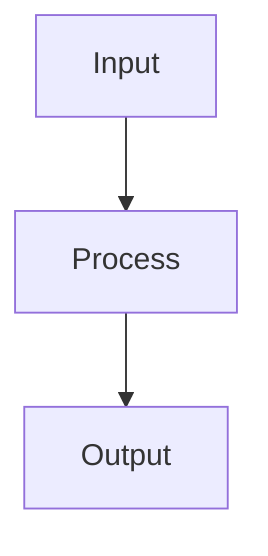

# 正文整理

目标：让笔记更容易再次学习、判断、执行和引用。

## 拆分

一篇笔记聚焦一个主要复用问题。

拆分条件：
- 第二个问题能独立复用。
- 内容需要独立链接。
- 标题可独立成立。

例子、补充、反例通常留在原笔记。

## 来源

默认不写来源区。来源有复查价值时才保留。

可链接：
- 原始素材
- 官方文档
- 论文
- 原文
- 高价值已有笔记

官方文档只保留入口和个人最小摘录。

## 术语

领域固定译名优先。

术语首次出现：`中文名 (English Full Name)`。
英文缩写首次出现：`ABC (English Full Name)`。

## Mermaid

节点和连线分开写。

## 文风

准确优先。短段落。结论先行。

只保留有价值内容，删除套话、管理痕迹和不服务复用的说明。
